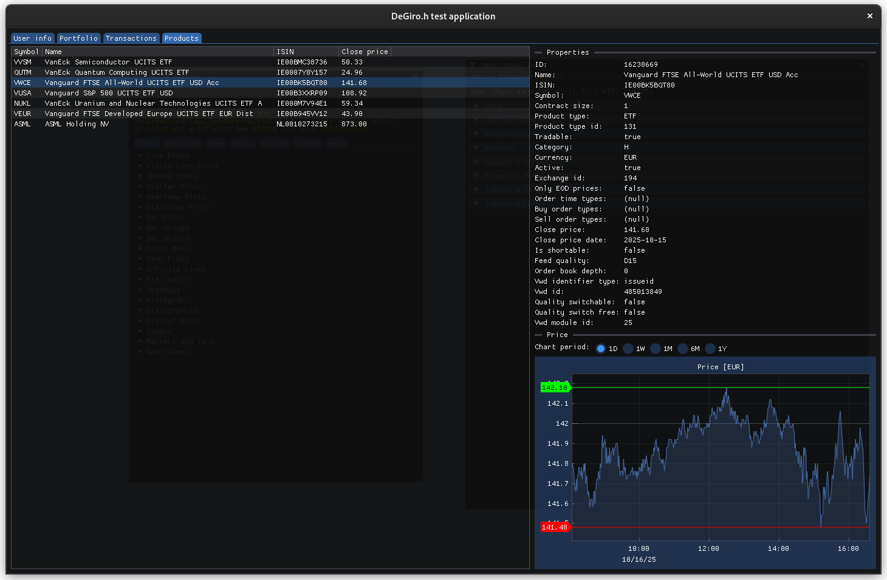

# degiro.h
<ins>**Unofficial**</ins> C library for interfacing with the popular broker [DeGiro](https://www.degiro.nl/).

### Important note
<ins>**Usage of this library is always at your own risk.**</ins>

DeGiro does **not** officially support an API. However, all functionality can be accessed via HTTP requests. Placement of orders through automation is explicitely not allowed by DeGiro and is therefore not implemented in this library. This library focusses on 'read-only' actions like retrieving information about products or transactions which can be used to generate insights and help in making decisions about your portfolio.

## Library
The C-based library can be used to interface with DeGiro. The library is stateless, which means there is no hidden data being stored. The end-user is responsible for managing the state `dg_state`, which is passed by reference to all library calls.

### Supported features:
* Login using Time-based One-Time Password (TOTP)
* Get user information
* Products
  - Get product info including properties like name, ISIN, currency, last closing price, etc.
  - View price history chart at different time scales
* Transactions (buying/selling of products)
  - Get details of all transactions executed, which include date, quantity, price, fees, etc.

### Dependencies
* [cJSON](https://github.com/DaveGamble/cJSON) for working with JSON objects
* [libcurl](https://curl.se/libcurl/) for handling HTTP requests 

## App
The provided application (built in C++, using [ImGui](https://github.com/ocornut/imgui) and [ImPlot](https://github.com/epezent/implot)) functions as a show-case for the functionalities of the library. It can also be used as a reference for how to use the library in your own project.

